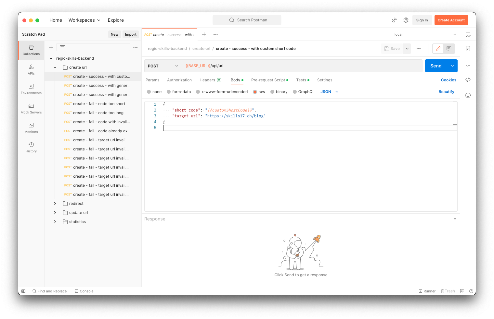
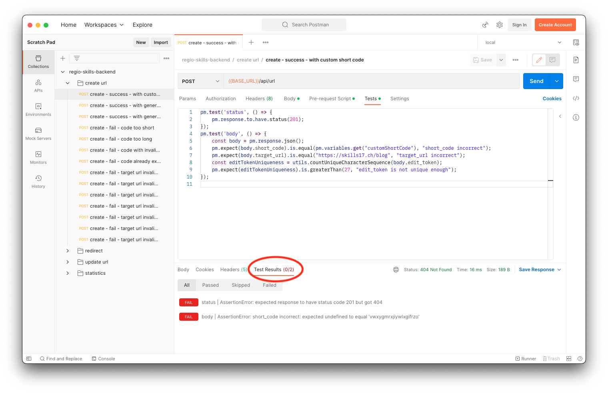
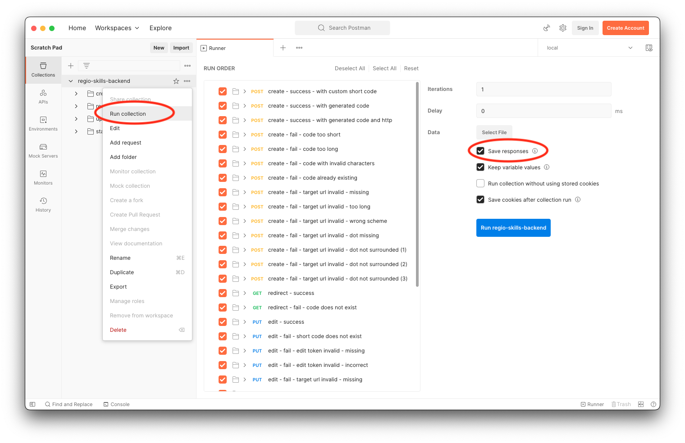

import { Highlight } from "@skills17/competitor-readme";

# Task - Short URL Service API

Your task is to create an API that implements a Short URL service. The API allows creation of short links. Users opening
the short link are redirected to the actual link.

## Table of Contents

- [Introduction](#introduction)
- [Validation](#validation)
- [Codes and Edit Tokens](#codes-and-edit-tokens)
- [Database](#database)
- [Tests](#tests)
- [Development Environment](#development-environment)
- [API](#api)
- [Postman Guide](#postman-guide)

## Introduction

A user can create a short URL given any URL and by optionally choosing the short ID. An example:

- User's Target URL: `https://www.ict-berufsbildung.ch/resources/SwissSkills_Bern_2022_Ranglisten_ICTskills.pdf`
- User's Short Code: `ictranks2022`
- Generated short URL: `http://localhost:4000/s/ictranks2022`

When the API is used to create a new short URL, it also creates an edit token that can be used to later change the redirect URL.
The edit token is long, cannot be guessed and is sent to the edit endpoint using an HTTP header.

When a short URL is opened, the application records some statistics. Namely it counts how many times the link was opened
with these dimensions: Time, User Agent, Accept Language, Referrer.

The user with the edit token is then able to get statistics about their short URL.

## Validation

The user can optionally submit a desired **short code** for the short URL to contain. This code has these validation rules:

- must only exist once
- must be at least 4 and at most 50 characters long.
- must only contain characters from this set: `a-z`, `A-Z`, `0-9`, `_`, `-`
- the first character must not be a digit

The **Target URL** that is redirected to by the short URL has these validation rules:

- must be at most 300 characters long
- must start with `https://` or `http://`
- must contain at least one `.` (dot)
- All `.` must be surrounded by at least 1 character that is not `/` nor `.`

## Codes and Edit Tokens

If the user does not submit their own **short code**, the server generates a short code for them.
It must be hard to predict the next code that will be generated when knowing the previous code.
Server generated codes underlay the same validation constraints as described above.
How the codes are generated is up to you. Generated codes should not be longer than __7 characters__.

The **edit token** generated must be at least 30 characters long and nearly impossible to guess.
It must also only exist once. How the edit token is generated is up to you.

## Database

The database with the name `skills` has been prepared for you with a structure and data. A database dump is also provided to you in `work/backend/dump.sql`.
You can use the dump to reset your database to the original state, should your database get damaged.

The tests assert that the original short URLs in the dump exist in the database.
If you happen to delete or modify them, you need to reset your database manually, to make the tests able to pass. If you never
delete or modify the original tables and rows, you should not need to reset the database to make the tests pass.

PHPMyAdmin is available at [http://localhost/phpmyadmin](http://localhost/phpmyadmin), and you should be automatically
logged in. In case this does not work, or you were logged out, the username is "root" and the password is "" (empty password).

## Tests

To evaluate the API, you have been provided with a Postman collection. Before running the tests, ensure your application is running.
You have two ways to execute the tests:

- Postman (visually): Open Postman (in the Dock on the left side), you should see the collection already imported.
  - We have prepared some detailed instructions at the bottom of the page in case you are not very familiar with Postman: [Postman Guide](#postman-guide).
- Newman (command line): Run the tests with `npm test` to see a command line output. This command will also show you how many points you will be awarded.

The points are not visible in the Postman UI.

<Highlight type="warning">
  There is an extra collection, not available for you, that will also be used to
  evaluate your solution that contains the exact same tests, but different
  values in the URLs and expected responses. So, do not catch specific values or
  return hard-coded responses, as this will fail later.
</Highlight>

Making all tests pass is hard. Please be aware that this is not an exam where you get a grade. This is a competition where
you are ranked among each other.

## Development Environment

You have been provided with boilerplate code to start coding. There are two setups:

- Node.JS with Express.js in `work/backend/src-node`.
  - You can start the server by running `npm start` within `work/backend`.
  - Your code changes are automatically applied. You do not need to restart the development server.
  - Console outputs are logged into the **terminal window** where you run `npm start`.
- PHP in `work/backend/src-php`.
  - You can start the development server by running `composer start` within `work/backend`.
  - Your code changes are automatically applied. You do not need to restart the development server.
  - PHP warnings, errors, and exceptions are logged into the **terminal window** where you run `composer start`.

<Highlight type="warning">
  You can choose freely between those two and are only expected to solve it in
  one stack. Should you switch over mid-way, the final solution that gets more
  points will be the one that is taken into account. Points cannot be
  accumulated from both of the two solutions.
</Highlight>

<Highlight type="error">
  You can only change files under `work/backend/src-node/` or
  `work/backend/src-php/`. All other files and the database will be reverted for
  the review process.

  You are therefore also **not** allowed to install additional NPM or Composer packages.
</Highlight>

## API

**General information:**

- The response bodies contain some static example data. Dynamic data from the database should be used.
- The order of properties in objects does not matter.
- The `Content-Type` header of a request must always be `application/json` for `POST` and `PUT`.
- The `Content-Type` header of a response is always `application/json` unless specified otherwise.
- Timestamps are formatted as ISO-8601 strings. E.g. `2032-01-31T21:59:35.000Z`.

---

### `POST /api/url`

This endpoint creates new short URLs. The server either generates the short code or accepts the user's given short code
if it is still available.

Also refer to [Codes and Edit Tokens](#codes-and-edit-tokens).

**Request Body**:

```json
{
  "short_code": "ictranks2022",
  "target_url": "https://www.ict-berufsbildung.ch/resources/SwissSkills_Bern_2022_Ranglisten_ICTskills.pdf"
}
```

| Property   | Comment                                      |
|------------|----------------------------------------------|
| target_url | required, also see [Validation](#validation) |
| short_code | optional, also see [Validation](#validation) |

**Response**:

#### Successful creation response:

Status Code: 201

Response Body:

```json
{
  "short_code": "ictranks2022",
  "target_url": "https://www.ict-berufsbildung.ch/resources/SwissSkills_Bern_2022_Ranglisten_ICTskills.pdf",
  "edit_token": "862eacbb-9062-4120-8d19-2e48248db117"
}
```

#### Invalid request body

Status Code: 400

Response Body:

```json
{
  "error": "Request body is not valid.",
  "invalid": true,
  "violations": {
    "target_url": {
      "message": "Target URL is required."
    },
    "target_url": {
      "message": "Target URL must be at most 300 characters long."
    },
    "target_url": {
      "message": "Target URL is not a valid URL."
    },
    "short_code": {
      "message": "Short Code must be at least 4 characters long."
    },
    "short_code": {
      "message": "Short Code must be at most 50 characters long."
    },
    "short_code": {
      "message": "Short Code contains invalid characters."
    },
    "short_code": {
      "message": "Short Code is already in use."
    }
  }
}
```

In the above example, all possible violations are shown. The actual returned violations should only be the fields which were actually invalid.
At most one validation per field is shown. E.g. `target_url` above cannot be returned twice.

---

### `GET /s/:code`

Collects metrics and redirects to the target URL.

**Response**:

#### Success:

Status: 302
Headers:

```
Location: <target url>
```

#### Non-existing short code

Status Code: 404


### `PUT /api/url/:code`

Edits an existing URL's target.

**Request**:

Headers:

```
X-EDIT-TOKEN: <edit-token>
```

Body:

```json
{
  "target_url": "https://www.ict-berufsbildung.ch/resources/SwissSkills_Bern_2022_Ranglisten_ICTskills.pdf"
}
```

| Property   | Comment                                      |
|------------|----------------------------------------------|
| target_url | required, also see [Validation](#validation) |

**Response**:

#### Success:

Status Code: 200

Response Body:

```json
{
  "short_code": "ictranks2022",
  "target_url": "https://www.ict-berufsbildung.ch/resources/SwissSkills_Bern_2022_Ranglisten_ICTskills.pdf",
  "edit_token": "862eacbb-9062-4120-8d19-2e48248db117"
}
```

The response contains the new `target_url`. The `short_url` and `edit_token` remain unchanged.

#### Invalid request body

Status Code: 400

Response Body:

```json
{
  "error": "Request body is not valid.",
  "invalid": true,
  "violations": {
    "target_url": {
      "message": "Target URL is required."
    },
    "target_url": {
      "message": "Target URL must be at most 300 characters long."
    },
    "target_url": {
      "message": "Target URL is not a valid URL."
    }
  }
}
```

#### Non-existing short code

Status Code: 404

Response Body:

```json
{
  "error": "Short code does not exist."
}
```

#### Edit Token is incorrect

Status Code: 403

Response Body:

```json
{
  "error": "Edit token does not match. Please specify the header X-EDIT-TOKEN."
}
```
---

### `GET /api/url/:code/statistics`

Returns aggregated timeseries metrics of the shortened URL.

**Request**:

Headers:

```
X-EDIT-TOKEN: <edit-token>
```

**Response**:

#### Success:

Status Code: 200

Response Body:

```json
{
    "short_code": "stats-test",
    "target_url": "https://www.example.org/test",
    "count": 22,
    "timeseries": {
        "resolution": "1h",
        "items": [{
            "timestamp": "2023-03-18T10:00:00.000Z",
            "count": 15,
            "metrics": [{
                "count": 10,
                "dimensions": [
                    { "key": "browser", "value": "chrome" },
                    { "key": "language", "value": "en" },
                    { "key": "referrer", "value": "https://www.example.org" }
            ]}, {
                "count": 5,
                "dimensions": [
                    { "key": "browser", "value": "chrome" },
                    { "key": "language", "value": "de" },
                    { "key": "referrer", "value": "https://www.example.org" }
                ]
            }]
        }, {
            "timestamp": "2023-03-18T11:00:00.000Z",
            "count": 7,
            "metrics": [{
                "count": 7,
                "dimensions": [
                    { "key": "browser", "value": "chrome" },
                    { "key": "language", "value": "en" },
                    { "key": "referrer", "value": "https://www.example.org" }
                ]
            }]
        }]
    }
}
```

| Property                                                     | Comment                                                                                                                                                                                                      |
|--------------------------------------------------------------|--------------------------------------------------------------------------------------------------------------------------------------------------------------------------------------------------------------|
| `short_code`                                                 | Short code of the URL                                                                                                                                                                                        |
| `target_url`                                                 | The current target URL                                                                                                                                                                                       |
| `count`                                                      | The total number of clicks.                                                                                                                                                                                  |
| `timeseries.resolution`                                      | Always `1h`                                                                                                                                                                                                  |
| `timeseries.items`                                           | Contains time bucket items with a timestamp, the timestamps are separated by the resolution, if there are no metrics for that bucket, the item shall be omitted. The array is sorted by timestamp ascending. |
| `timeseries.items.$.timestamp`                               | The bucket timestamp. Refers to the start time of the bucket. It is aligned to full hours, not the current minute.                                                                                           |
| `timeseries.items.$.count`                                   | Number of clicks in that bucket.                                                                                                                                                                             |
| `timeseries.items.$.metrics`                                 | Contains metrics per dimension key-values, the `count` contains the count of clicks of the URL with these dimensions, the sum of all `count` in the bucket gives the total clicks inside the bucket.         |
| `timeseries.items.$.metrics.$.count`                         | Number of clicks in that bucket and these dimensions. The metrics are sorted by this count descending.                                                                                                       |
| `timeseries.items.$.metrics.$.dimensions`                    | The dimensions always hold 3 elements. They are sorted by `key` alphabetically.                                                                                                                              |
| `timeseries.items.$.metrics.$.dimensions.$.[key="browser"]`  | This dimension refers to values read from the `user-agent` request header.                                                                                                                                   |
| `timeseries.items.$.metrics.$.dimensions.$.[key="language"]` | This dimension refers to values read from the `accept-language` request header.                                                                                                                              |
| `timeseries.items.$.metrics.$.dimensions.$.[key="referrer"]` | This dimension refers to values read from the `referrer` request header.                                                                                                                                     |

If a dimension value is absent, it shall still be added to `timeseries.items.$.metrics.$.dimensions.$.[key]` with a value of `null`.

You can use the header values directly, and do not need to parse them. This would not produce good results in the real
world, however the tests are only supplying a minimal set of possible values.

#### Non-existing short code

Status Code: 404

Response Body:

```json
{
  "error": "Short code does not exist."
}
```

#### Edit Token is incorrect

Status Code: 403

Response Body:

```json
{
  "error": "Edit token does not match. Please specify the header X-EDIT-TOKEN."
}
```

---

## Postman Guide

Postman is a graphical tool that allows you to test your API. In Postman you can create requests and organize them
in a collection. We have created a testing collection for you. When you open Postman, you should see this collection
already imported.

[](/api/images/backend/backend/postman-guide/postman-request.png)

If the collection is not there, you can import the collection from the `work/backend/collections/` folder into Postman.
To import, open Postman, click on File and then "Import" to select the collection.

In the screenshot above, you can see that the URL says `{{BASE_URL}}`.
This is an environment variable in Postman that is already set to the correct value for you: `http://localhost:4000`.

After sending a request, you will see if the tests were successful in the "Test Results" tab like this:

[](/api/images/backend/backend/postman-guide/postman-request-tests.png)

Clicking on the tab reveals more detailed test results.

You can also run all requests at once, which is recommended. To do that, click on the context menu icon of the collection,
and click on "Run collection". This will open the following view:

[](/api/images/backend/backend/postman-guide/postman-run-all.png)

To be able to inspect responses, you also need to check "Save responses".

Your goal is to make more tests pass than your fellow competitors can manage to :wink:.
